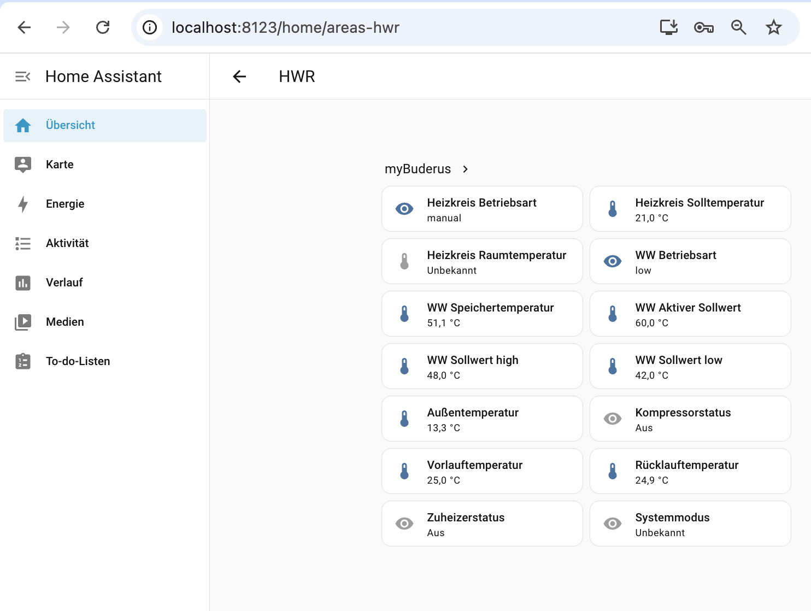

# myBuderus — Home Assistant Integration

Unofficial Home Assistant custom component for Bosch/Buderus heat pumps (HMC310 / MX300 and compatible). Provides 14 read-only sensor entities via the Bosch Pointt API.



## Sensors

| Entity | Description | Unit |
|---|---|---|
| Heizkreis Betriebsart | Heating circuit operation mode | — |
| Heizkreis Solltemperatur | Heating circuit setpoint | °C |
| Heizkreis Raumtemperatur | Room temperature | °C |
| WW Betriebsart | DHW operation mode | — |
| WW Speichertemperatur | DHW storage temperature | °C |
| WW Aktiver Sollwert | DHW active setpoint | °C |
| WW Sollwert high | DHW high setpoint | °C |
| WW Sollwert low | DHW low setpoint | °C |
| Außentemperatur | Outdoor temperature | °C |
| Kompressorstatus | Compressor status | — |
| Vorlauftemperatur | Supply temperature | °C |
| Rücklauftemperatur | Return temperature | °C |
| Zuheizerstatus | Backup heater status | — |
| Systemmodus | Season optimizer mode | — |

All sensors are polled via a single bulk request. The default polling interval is 300 seconds (configurable down to 30 seconds).

## Installation

### Option 1: HACS (recommended)

1. In Home Assistant, open **HACS → Integrations**.
2. Click the three-dot menu (⋮) in the top right and select **Custom repositories**.
3. Enter the repository URL and set the category to **Integration**, then click **Add**.
4. Search for **myBuderus** in HACS and click **Download**.
5. Restart Home Assistant.
6. Go to **Settings → Integrations → Add Integration** and search for **myBuderus**.

### Option 2: Manual

1. Copy the `custom_components/mybuderus/` folder into your Home Assistant config directory:

```
<ha-config>/
└── custom_components/
    └── mybuderus/
```

2. Restart Home Assistant.

3. Go to **Settings → Integrations → Add Integration** and search for **myBuderus**.

## Authentication

This integration uses OAuth2 with PKCE against the SingleKey ID identity provider. Because the registered redirect URI is an Android custom scheme (`com.buderus.tt.dashtt://`), automatic redirect capture is not possible. Authentication requires a one-time manual copy-paste step:

1. The integration generates a login link and shows it in the setup dialog.
2. Open the link in your browser and log in with your SingleKey ID credentials (the same account you use in the myBuderus app).
3. After login, the browser will show an error page — this is expected. The redirect to the Android app scheme simply cannot be opened in a desktop browser.
4. Open the browser developer console (**F12**) and switch to the **Network** tab.
5. Filter requests by `com.buderus` — you will see a failed request to a URL starting with `com.buderus.tt.dashtt://app/login?code=...`.
6. Copy the full URL (or just the `code` parameter value) and paste it into the integration setup field.

### Token lifetime

The API issues two tokens:

- **Access token** — short-lived (typically 1 hour). Used for all API requests. The integration checks expiry before every poll and refreshes automatically in the background — no user action required.
- **Refresh token** — long-lived. Used to obtain new access tokens without re-authenticating. As long as the integration is active and polling regularly, the refresh token is kept alive.

If Home Assistant is offline for an extended period (weeks) and the refresh token expires, the integration will show a **Re-authenticate** notification in the UI. In this case, repeat the manual login steps above — no reinstallation needed.

## Limitations

- Read-only — no control of the heat pump in this version.
- Requires an active myBuderus / Buderus app account (SingleKey ID).
- Tested on HMC310 controller with MX300 heat pump. Other Bosch/Buderus gateways using the same Pointt API should work but are untested.
